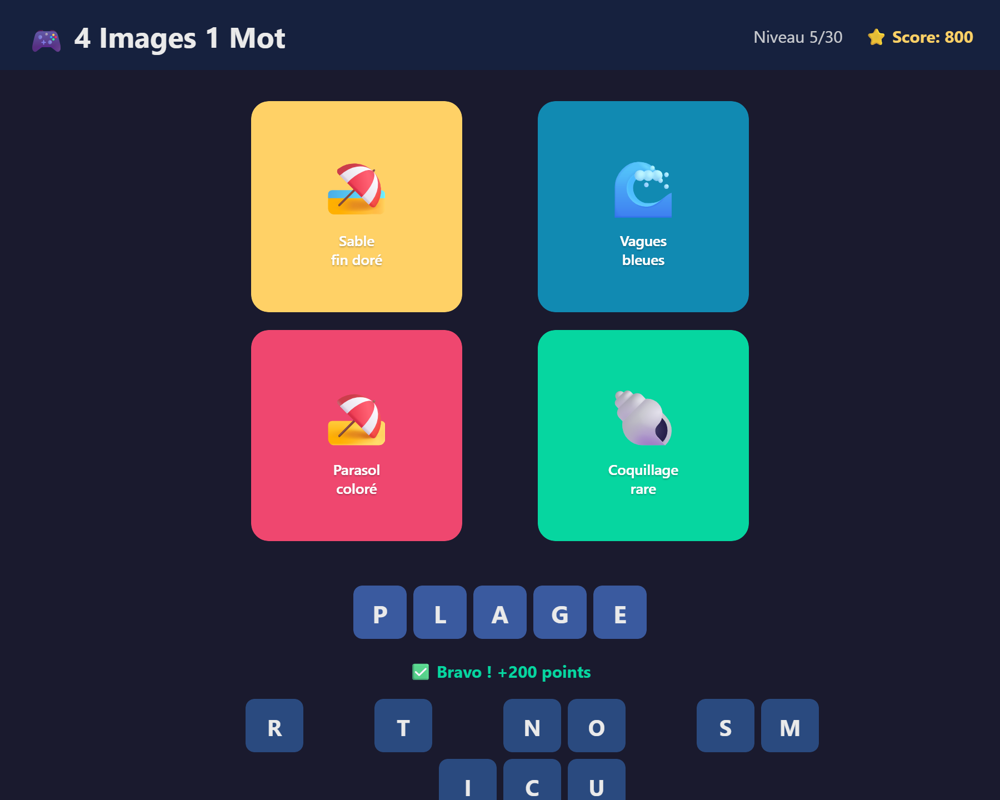

# 🎮 4 Images 1 Mot / 4 Pics 1 Word

> **[Français](#fr)** | **[English](#en)**



---

<a id="fr"></a>

## 🇫🇷 Français

Jeu de devinettes pour Linux — Trouve le mot commun aux 4 images !

### Fonctionnalités

- 🖼️ **30 puzzles** avec 3 niveaux de difficulté
- ⌨️ Sélection de lettres par **clic ou clavier**
- ⭐ Système de **score** (+200pts par mot, -50pts par indice)
- 💡 **Indices** pour révéler une lettre
- ⏭️ Possibilité de **passer** un puzzle
- 🎨 Interface sombre moderne

### 🌍 Langues supportées

La langue est **détectée automatiquement** depuis le système (`LANG`, `LC_ALL`).
Un sélecteur dans le header permet de changer manuellement.

| Langue | Code |
|--------|------|
| 🇫🇷 Français | `fr` |
| 🇬🇧 English | `en` |
| 🇪🇸 Español | `es` |
| 🇩🇪 Deutsch | `de` |
| 🇮🇹 Italiano | `it` |
| 🇧🇷 Português | `pt` |

### Installation

#### Depuis les sources
```bash
sudo apt install python3-tk
git clone https://github.com/tienou/4images1mot.git
cd 4images1mot
python3 main.py
```

#### Paquet .deb (Debian/Ubuntu/Mint)
```bash
sudo dpkg -i 4images1mot_1.0.0_all.deb
```

#### Paquet .rpm (Fedora/RHEL/openSUSE)
```bash
sudo dnf install 4images1mot-1.0.0-1.noarch.rpm
```

#### AppImage (universel)
```bash
chmod +x 4images1mot-1.0.0-x86_64.AppImage
./4images1mot-1.0.0-x86_64.AppImage
```

### 📦 Packages disponibles

| Format | Commande | Distribution |
|--------|----------|-------------|
| **.deb** | `make deb` | Debian, Ubuntu, Mint |
| **.rpm** | `make rpm` | Fedora, RHEL, openSUSE |
| **AppImage** | `make appimage` | Toutes (portable) |
| **Flatpak** | `make flatpak` | Toutes (sandboxé) |
| **Snap** | `make snap` | Ubuntu, Manjaro |
| **Tous** | `make all` | Build tout d'un coup |

#### Prérequis pour le build

| Package | Outil requis |
|---------|-------------|
| .deb | `dpkg-dev` |
| .rpm | `rpm-build` |
| AppImage | `wget` (télécharge appimagetool) |
| Flatpak | `flatpak-builder` + runtime freedesktop 23.08 |
| Snap | `snapcraft` |

### 🎮 Contrôles

| Action | Contrôle |
|--------|----------|
| Placer une lettre | Clic sur la lettre ou touche clavier |
| Retirer une lettre | Clic sur la lettre placée |
| Retirer la dernière | `Backspace` |
| Effacer tout | Bouton Effacer |

---

<a id="en"></a>

## 🇬🇧 English

A word guessing game for Linux — Find the word that connects the 4 images!

### Features

- 🖼️ **30 puzzles** with 3 difficulty levels
- ⌨️ Letter selection by **click or keyboard**
- ⭐ **Scoring system** (+200pts per word, -50pts per hint)
- 💡 **Hints** to reveal a letter
- ⏭️ Option to **skip** a puzzle
- 🎨 Modern dark UI

### 🌍 Supported languages

The language is **auto-detected** from the system (`LANG`, `LC_ALL`).
A selector in the header allows manual switching.

| Language | Code |
|----------|------|
| 🇫🇷 Français | `fr` |
| 🇬🇧 English | `en` |
| 🇪🇸 Español | `es` |
| 🇩🇪 Deutsch | `de` |
| 🇮🇹 Italiano | `it` |
| 🇧🇷 Português | `pt` |

### Installation

#### From source
```bash
sudo apt install python3-tk
git clone https://github.com/tienou/4images1mot.git
cd 4images1mot
python3 main.py
```

#### .deb package (Debian/Ubuntu/Mint)
```bash
sudo dpkg -i 4images1mot_1.0.0_all.deb
```

#### .rpm package (Fedora/RHEL/openSUSE)
```bash
sudo dnf install 4images1mot-1.0.0-1.noarch.rpm
```

#### AppImage (universal)
```bash
chmod +x 4images1mot-1.0.0-x86_64.AppImage
./4images1mot-1.0.0-x86_64.AppImage
```

### 📦 Available packages

| Format | Command | Distribution |
|--------|---------|-------------|
| **.deb** | `make deb` | Debian, Ubuntu, Mint |
| **.rpm** | `make rpm` | Fedora, RHEL, openSUSE |
| **AppImage** | `make appimage` | All (portable) |
| **Flatpak** | `make flatpak` | All (sandboxed) |
| **Snap** | `make snap` | Ubuntu, Manjaro |
| **All** | `make all` | Build everything |

#### Build prerequisites

| Package | Required tool |
|---------|--------------|
| .deb | `dpkg-dev` |
| .rpm | `rpm-build` |
| AppImage | `wget` (downloads appimagetool) |
| Flatpak | `flatpak-builder` + freedesktop 23.08 runtime |
| Snap | `snapcraft` |

### 🎮 Controls

| Action | Control |
|--------|---------|
| Place a letter | Click on the letter or press the key |
| Remove a letter | Click on the placed letter |
| Remove last | `Backspace` |
| Clear all | Clear button |

---

## Licence / License

MIT
